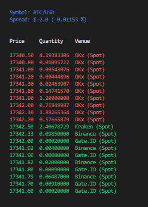

# crypto-stream
An experiment in unifying multiple cryptocurrency exchange streams under a single API. Think CCXT websockets, but in Rust.

---

:construction: *This library is an active work in progress and not yet suitable for production use* :construction:



## Features:
* Simple websocket subscription API
* Supports real-time trade and L2 quote data
* Transforms exchange-native messages to a common `MarketData` type, for multi-venue signal generation
* Cross-exchange order book building
* Terminal UI for visualisation
* Websocket integrations for:
    * Binance (USD Futures + Spot)
    * Coinbase (Spot)
    * OKx (Spot)
    * Huobi (Spot)
    * Gate.io (Spot)
    * Kraken (Spot)

## Roadmap:
* Add support for futures contracts
* Add support for additional market data streams (liquidations, funding ticker, mark price)
* Add support for additional sinks (mmap file, gRPC, zmq socket)
* Add support for user-stream data streams (order fills/cancellations, balance updates)
* Add support for streaming Uniswap V2/V3 reserve changes


## Getting started:
`$ cargo run --example combine_books --release`

or 

```rust, no_run
use mimalloc::MiMalloc;
#[global_allocator]
static GLOBAL: MiMalloc = MiMalloc;

use crypto_stream::{
    build_venue_subscriptions,
    model::*,
    orderbook::CrossVenueOrderBook,
    subscriptions_into_stream,
    tui::{render_orderbook, setup_terminal_ui},
    websocket::{WebsocketSubscription, WebsocketSubscriptionKind},
};
use futures::StreamExt;
use std::time::{Duration, Instant};
use std::vec;

#[tokio::main]
async fn main() {
    let subscriptions = vec![
        WebsocketSubscription::new(Venue::BinanceSpot, "BTC", "USDT", InstrumentKind::Spot, WebsocketSubscriptionKind::Quote),
        WebsocketSubscription::new(Venue::GateIO, "BTC", "USDT", InstrumentKind::Spot, WebsocketSubscriptionKind::Quote),
        WebsocketSubscription::new(Venue::Okx, "BTC", "USDT", InstrumentKind::Spot, WebsocketSubscriptionKind::Quote),
    ];

    // subscribe to websockets for each venue
    let venue_subs = build_venue_subscriptions(subscriptions);

    // combine each venues websocket stream into a combined stream
    let mut market_data = subscriptions_into_stream(venue_subs).await;

    // initialise TUI
    let mut terminal = setup_terminal_ui();

    let mut cross_book = CrossVenueOrderBook::new("BTC/USD".to_string(), 10);

    const TICK_RATE: Duration = Duration::from_millis(100);
    let mut last_draw = Instant::now();
    loop {
        if let Some(msg) = market_data.next().await {
            // map quote streams to combined orderbook levels
            cross_book.update(&msg);
            let levels = cross_book.to_levels(cross_book.depth);

            if last_draw.elapsed() > TICK_RATE {
                last_draw = Instant::now();

                // render combined orderbook in terminal
                terminal
                    .draw(|f| render_orderbook(f, &cross_book.symbol, levels))
                    .expect("error rendering TUI");
            }
        }
    }
}
```